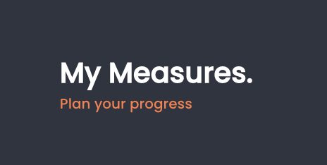

# My Measures

My Measure is a sideproject rebase my fundamentals in Javascript / React / Redux (and other middleware).

## Available Scripts

In the project directory, you can run:

### `npm start`

Run API Platform and  mysql on docker
Open [https://localhost:8000](https://localhost:8000) to view API Platform configuration.

### `npm start-front`

Runs the app in the development mode. 
Open [http://localhost:3000](http://localhost:3000) to view it in the browser.

# What I use ?
- React JS
- Redux / Redux-thunk / Redux-Saga (deprecated)
- API Platform

# Platform
- MySql & adminer sur Docker
- API Platform on Symfony server

# Resources
- https://engineering.haus.com/connecting-redux-to-your-api-eac51ad9ff89
- http://www.passportjs.org/docs/
- https://medium.com/keycloak/secure-react-app-with-keycloak-4a65614f7be2
- https://scalac.io/user-authentication-keycloak-1/
